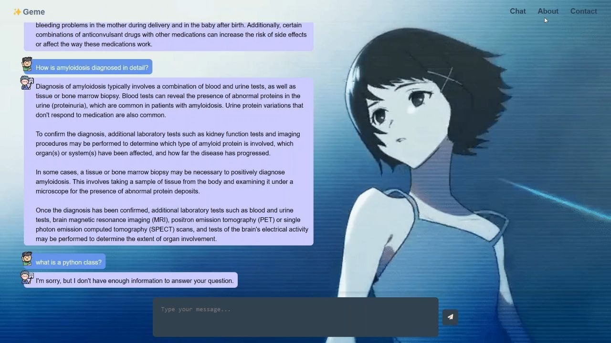
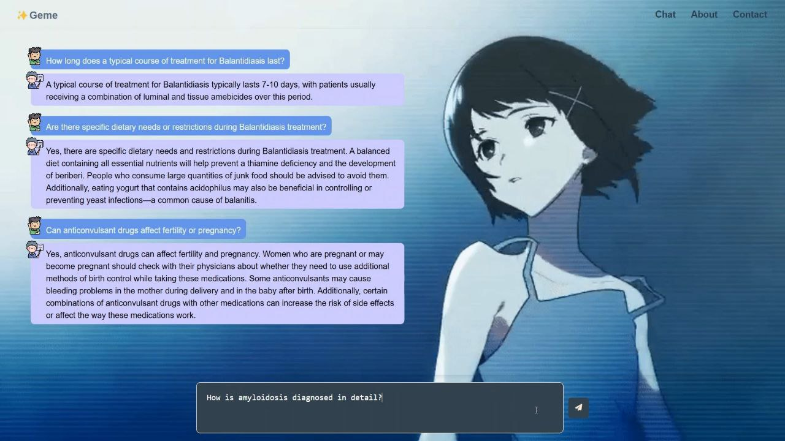

# 🦒Giraffe

Welcome to Giraffe👋🏽, your trusted medical chatbot.
My goal is to provide reliable and accurate medical information to assist you in understanding health concepts.

*This chatbot is for informational purposes only and is not a substitute for professional medical advice.*

---

## Closed-Domain ChatBot

Retrival augmented generation techinques to leravage a closed domain chatbot.

- **Pincone victore store** to store chunks of data with cosine similarity metric.
- **Generator** Llama 3.2 3B parameter.
- **Embedding model** nomic-embed-text with 768 dimensions.
- **Data** book in medicen *Gale Research Company._Longe, Jacqueline L._Blanchfield, Deirdre.*

*Here we will ask Geme an outside-domain question to test her trustneth.*

---

## Software Development

Seperation of concerns design pattern with modular architecture to separate business logic, data access, and presentation layers, reducing coupling and enhancing maintainability.

- **FastAPI** for RESTAPIs with asynchurounios approach.
- **Pydantic** for request response validation.

I designed the user interface with my taste in art with Html, CSS and vanella Javascript.
