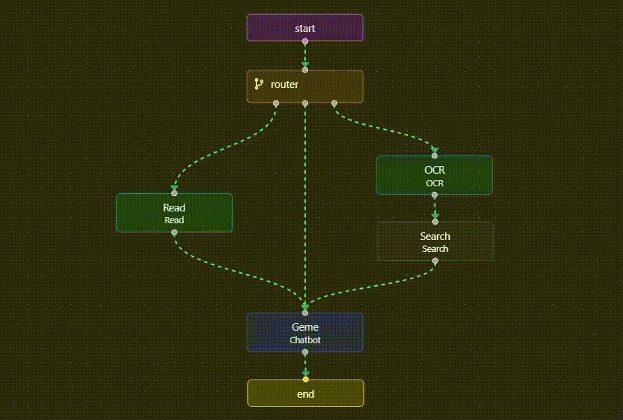

# Geme - Medical Intelligent Agent

`Python` `Ollama` `LangChain` `LangGraph` `Pinecone` `FastAPI` 

Geme is an agent designed to help people with medical information and tasks. She can process images, perform web searches, and read books to identify and address user needs. My goal is to bridge the gaps found in open-source LLMs like quen2.5:7b, gemma3:4b, and gemma3:12b by reducing reliance on the REACT design pattern and the requirement for the LLM to be the sole engine for handling conditions. Instead, I have incorporated logical routers and one-shot semantic classification.

<!-- <iframe 
    width="600" 
    height="340" 
    src="https://www.youtube.com/watch?v=N9FvUrZo66M&list=RDN9FvUrZo66M&start_radio=1" 
    frameborder="0" 
    allowfullscreen>
</iframe> -->

## Tools

| Tool       | Technology                  | Description                                                             |
| :--------- | :-------------------------- | :---------------------------------------------------------------------- |
| OCR        | Gemma3:4b                   | Extracts text from images using vision prompts.                         |
| Search     | Tavily search tool          | Retrieves three relevant web search results based on the query.         |
| RAG        | Pinecone / nomic-embed-text | Retrieves relevant, pre-chunked document segments by cosine similarity. |
| Reranker   | Cohere rerank-v3.5          | Ranks document chunks to select the top five most relevant.             |
| Classifier | Qwen2.5:7b                  | Semanticlly classify question into general or need retriever.           |
| Chatbot    | Gemma3:12b                  | Engages users with a friendly and closed-domain persona.                |

## Prompts

| Prompt                       | Description                                                        |
| :--------------------------- | :----------------------------------------------------------------- |
| Persona                      | LLM adopts a funny little girl persona for relatable responses.    |
| Return Format                | Provides friendly plain text within a closed-domain setup.         |
| Text Extractor               | Guides the vision model to accurately extract text from images.    |
| Semantic Classifier          | Distinguishes general from medical queries to route appropriately. |
| Retriever                    | Generates five query variations for vector store searches.         |
| Web Search Query             | Creates a query combining image text and user input.               |
| Chatting with Search Results | Integrates web search results into its responses.                  |
| Chatting with RAG            | Uses retrieved documents to support accurate answer generation.    |
| Chatting General             | Responds in a friendly, human-like tone for casual interactions.   |

## State

| Key           | Description                                                     |
| :------------ | :-------------------------------------------------------------- |
| Messages      | User and Geme messages exchanged during the conversation.       |
| Context       | Semantically retrieved documents relevant to the user’s query.  |
| Image         | Path of the image, triggering the OCR node if present.          |
| Transcription | Text extracted from the image by the OCR node.                  |
| Search        | Formatted search results retrieved from the Tavily search tool. |

## Workflow

    
    
    

### 1. Router

* Image Input: If the input is an image, the router immediately routes it to the **OCR**.
* Textual Input: If the input is text, the LLM performs a one-shot semantic classification on the user query.
    * **RAG**: If the LLM identifies the query as requiring information from a medical book.
    * **Chatbot**: If the LLM determines that the query is a general conversation.

---

### 2. OCR

* This node uses *Gemma3:4b* with its vision capabilities and a text extraction prompt to extract the text from the image.
* The extracted text is placed into the state key *transcription*.
* The image path is removed from the state key *image* for subsequent invocations when chatting history is involved.
* Image is removed from the temporary directory.

### 3. Web Search

* *Qwen2.5:7b* creates a search query from the text extracted by OCR and the original user question.
* Tavily search is used to obtain three search results, which are then formatted clearly, including links and documents.
* These results are placed into the state key *search*.

### 4. Chatbot

* The *Gemma3:12b* is prompted with *persona*, *return format*, and *chatting with search results* as a system message.
* Tool message includes the state key *search*.
* If the search results do not provide a relevant answer, Geme politely states that it cannot answer.

---

### 2. RAG

* The *Qwen2.5:7b* generates five different queries that are semantically similar to the user's question and uses them to search for five documents per query.
* The search is conducted in *Pinecone* indexing using the *nomic-embed-text* embedding model with cosine similarity as the metric and duplicate chunks are removed.
* The *rerank-v3.5* reranker model is used to select the five most relevant documents from the remaining documents.
* These documents are formatted in descending order of relevance and stored in the state key *context*.

### 3. Chatbot

* The *Gemma3:12b* is prompted with *persona*, *return format*, and *chatting with RAG* as a system message.
* Tool message includes the state key *context*.
* If the context does not provide a relevant answer, Geme politely states that it cannot answer.

---

### 2. Chatbot

* The *Gemma3:12b* is prompted with *persona*, *return format*, and *Chatting General* as a system message to respond to general conversations and chat history.
* It maintains a closed domain focused on medicine.
